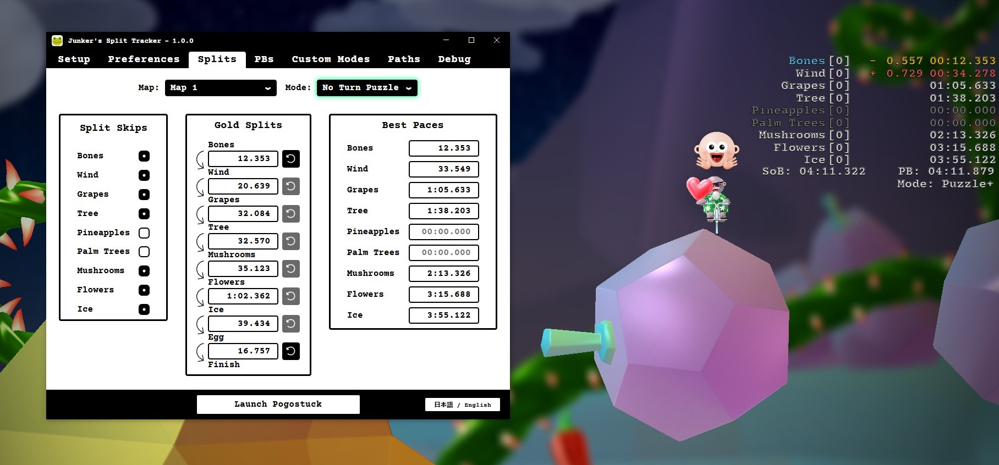

# pogostuck-split-tracker
A pogostuck split tracker improving on the basic ingame tracker :).

## What it does
The ingame Pogostuck split tracker is pretty basic, this app tries to improve on that.
Additionally to the basic features it also has:
- gold splits
- sum of bests
- hiding splits that are skipped
- old split names (very important)
- Saving your best paces
- Gold Splits as your ingame splits
- reset counters
- custom mode support (e.g. boostless, no turn puzzle, etc)

(Coming at some point)
- custom map support
- More Stats and Graphs to show you the stats :)

## Setup
### Installation
So i personally would recommend using the newest release in the GitHub `Releases` tab on the right. For that just go to the lastest release and download the .exe installer!

If you want to get the newest changes (and maybe bugs) you can setup the project yourself.

- Clone the repository with `git` or download the source code as a zip file.
- Install the latest version of [Node.js](https://nodejs.org/en/download/).
- Open the project folder in a terminal.
- Run `npm install` to install the dependencies.
- Run `npm run dist` to build the application.
- Then in the ``./dist`` folder you can find the executable installer.

### Usage
When starting it for the first time, you need to set up some stuff. You will (hopefully) find all information in the ``Setup`` tab in the app.
If there are any questions just dm me on discord (@derjunker). I'd love to help out and receive feedback!

## Limitations
It sadly does **not work with fullscreen**! You need to use borderless or windowed mode :(. Maybe this changes at some
point but i am limited by the [technology of my time](https://github.com/electron/electron/issues/11219) o7.
I will try to make it nicer to configure for a 2nd monitor or to run in the background, so you can see it after you 
are done with your run.

I only tested this on Windows, as most pogo players are on windows afaik. So it might not work on other Operating Systems.

Windows 11 insists on having a 1px border around every window. If that's an issue you: [this might help](https://pureinfotech.com/remove-pixel-border-windows-11/) (i didnt test it myself tho).

The Windows 11 window-shadow can be removed in settings. For all windows 11 users there should be information in the "Setup" tab of the app. **If thats not the case:** then contact me!
